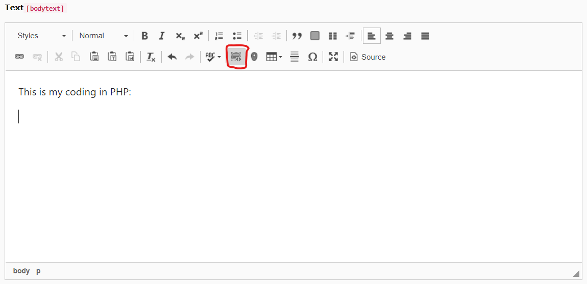
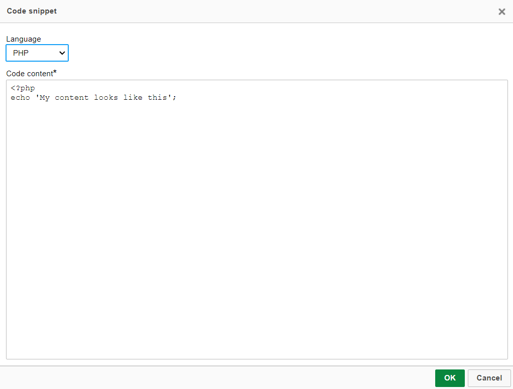
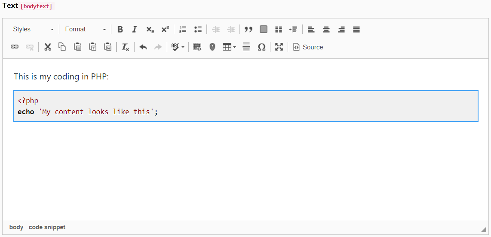

.. ==================================================
.. FOR YOUR INFORMATION
.. --------------------------------------------------
.. -*- coding: utf-8 -*- with BOM.

.. include:: ../Includes.txt

.. _user-manual:

Users Manual
============

Target group: **Editors**

Go to a content element with the CKEditor inside to add text and/or codesnippets.

|

.. tip::

   Use the *Insert Code Snippet* button in CKEditor to add code snippets

   Insert Code Snippet button

|

.. tip::

   Select code snippet language and insert coding

   Insert Code Snippet

|

.. tip::

   Preview of your code snippet in CKEditor in TYPO3 backend

   Preview in CKEditor

|

.. _user-faq:

FAQ
---
Which programming languages I can use to insert code snippets?
^^^^^^^^^^^^^^^^^^^^^^^^^^^^^^^^^^^^^^^^^^^^^^^^^^^^^^^^^^^^^^
With the default plugin there are following languages/code formattings available to select:
Apache, Bash, CoffeeScript, C++, C#, CSS, Diff, HTML, HTTP, INI, Java, JavaScript, JSON, Makefile, Markdown, Nginx, Objective-C, Perl, PHP, Python, Ruby, SQL, VBScript, XHTML, XML

.. _user-gethelp:

Get help
--------
If there are any other questions, please contact me or write an issue/request on `Github <https://github.com/Kephson/rte_ckeditor_codesnippet>`_.
